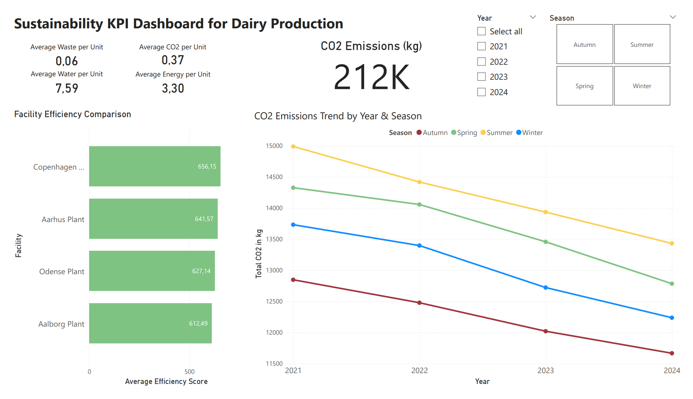
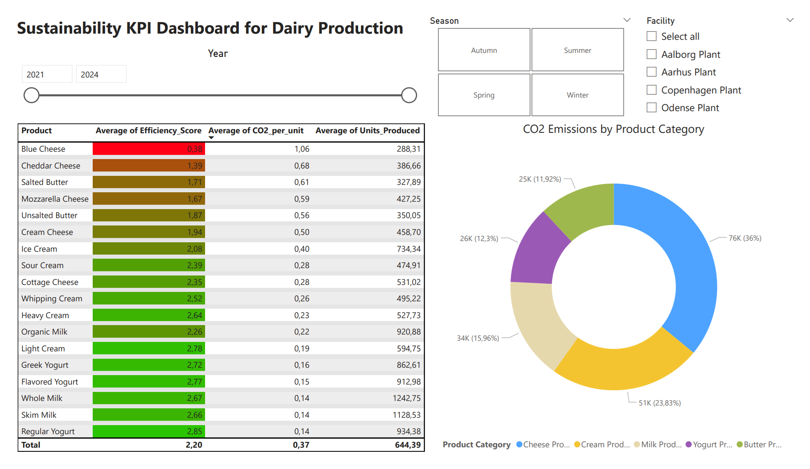

# Sustainability KPI Tracking for Dairy Production

This project simulates how a dairy production company can monitor environmental and operational sustainability using structured KPIs and business intelligence tools.

The objective was to design a clear decision-support dashboard that enables management to compare facilities, products, and seasonal performance using measurable sustainability indicators.

The solution follows a structured analytics workflow:

Python → SQL → Power BI

---

## Dashboard Preview

### Page 1 – Executive & Operational Overview

This page provides a management-level overview including:

- Total CO₂ emissions (212K kg)
- Average CO₂, energy, water, and waste per unit
- Facility efficiency benchmarking
- CO₂ emissions trend by year and season

---

### Page 2 – Product-Level Sustainability Analysis

This page focuses on detailed analysis including:

- CO₂ emissions by product category
- Product-level efficiency scores
- CO₂ intensity per unit
- Units produced per product
- Interactive filtering by year, season, and facility

---

## Business Context

Danish companies operate under increasing ESG and sustainability reporting requirements.  
However, environmental data is often available but not structured into comparable performance metrics.

This project demonstrates how operational production data can be transformed into measurable sustainability KPIs that support:

- Performance benchmarking  
- Operational transparency  
- Product portfolio evaluation  
- Data-driven decision-making  

---

## Key Results

### Overall Environmental Performance

- Total CO₂ emissions: 212,000 kg  
- Average CO₂ per unit: 0.37 kg  
- Average energy per unit: 3.30  
- Average water per unit: 7.59  
- Average waste per unit: 0.06  

Per-unit normalization allows fair comparison across facilities and products.

---

### Facility Benchmarking

Efficiency scores show measurable performance differences:

- Copenhagen Plant – highest efficiency  
- Aarhus Plant – second  
- Odense Plant – moderate  
- Aalborg Plant – lowest efficiency  

---

### Product Insights

- Cheese products account for 36% of total CO₂ emissions  
- Blue Cheese has the highest CO₂ and energy intensity  
- Yogurt and Milk products show higher efficiency scores  
- Regular Yogurt and Whole Milk are among the most sustainable products per unit  

---

## Project Architecture

1. Raw production and environmental data collected (CSV files)  
2. Data cleaning and KPI preparation in Python (Pandas)  
3. Aggregation and metric calculation using SQL  
4. Interactive reporting and visualization in Power BI  

The structure reflects a practical business analytics workflow.

---

## Tools & Technologies

- Python (Pandas)  
- SQL  
- Power BI  
- CSV datasets  
