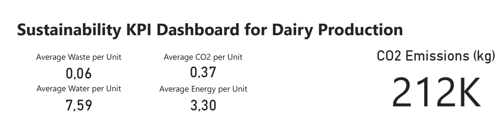

# Sustainability KPI Tracking for Dairy Production

This project simulates how a dairy production company can monitor environmental and operational sustainability using structured KPIs and business intelligence tools.

The objective was to design a decision-support dashboard that allows management to compare facilities, products, and seasonal performance using measurable sustainability indicators.

The solution follows a structured analytics workflow:

Python → SQL → Power BI

---

## Dashboard Preview

### Overall KPI Overview

### Facility Benchmarking

### Product Sustainability Analysis

*(Replace image names with your actual screenshot file names.)*

---

## Business Context

Companies in Denmark operate under increasing ESG and sustainability requirements.  
However, environmental data is often collected but not transformed into structured, comparable KPIs.

This project demonstrates how operational production data can be converted into decision-ready sustainability metrics.

---

## Key Results

### Overall Sustainability Performance

- Total CO₂ emissions: 212,000 kg  
- Average CO₂ per unit: 0.37 kg  
- Average energy per unit: 3.30  
- Average water per unit: 7.59  
- Average waste per unit: 0.06  

Per-unit normalization enables fair comparison across products and facilities.

---

### Facility Benchmarking

- Copenhagen Plant – highest efficiency  
- Aarhus Plant – second  
- Odense Plant – moderate  
- Aalborg Plant – lowest efficiency  

---

### Product-Level Insights

- Cheese products account for 36% of total CO₂ emissions  
- Blue Cheese has the highest CO₂ and energy intensity  
- Yogurt and Milk products show higher efficiency scores  
- Regular Yogurt and Whole Milk are among the most sustainable products per unit  

---

### Seasonal Patterns

CO₂ emissions fluctuate between approximately 11,500 kg and 15,000 kg (2021–2024), indicating seasonal operational impact on sustainability performance.

---

## Project Structure
